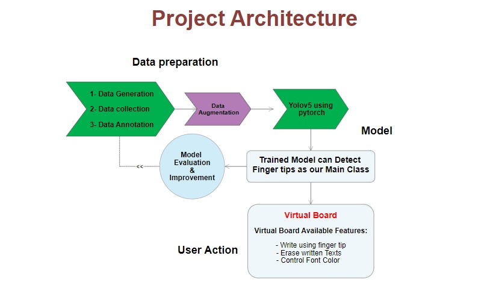

## Virtual Board
<p align="justify">
  The virtual board project is aimed towards the educational domain in order to make it easier for instructors  to express concepts by drawing and writing with relative ease using hand gestures.
</p>
    
### Why We Need Virtual Board?  
<p align="justify">
    We need the virtual board to make it easy for people to address their explanations to their audience through hand writing and drawing in a real time environment while also adding other functions to make the board more interactive to the user, the benefit of the virtual board is to remove uneasiness of mouse writing and drawing and also to make it more clear for the audience to follow up with your ideas.
</p>


## Requirements 🐍
- [x] Pytoch-GPU==1.10.0
- [x] OpenCV==4.5.4


## Dataset 📁

[](https://drive.google.com/file/d/1TiianKUdUa5eHt4Wn1GlNZWqQ_jVR9jY/view?usp=sharing)

We had to generate our dataset which is around 3500 images using a python script to generate it. But we had to label the dataset manually which was time-consuming so we started using our model to try to predict the bounding boxes points for our new data images and print the annotation as text but we had to check the sanity of the prediction manually to ignore bad data. We also added more images from other datasets found that served our approach and of course, we did tons of augmentation.
Note : This annotation is fitted for only YOLOv5 with pytorch if you needed to use it with any other model you have to update it using Roboflow .

## Project Architecture 



## Model used

### In which we used Yolov5?
We used Yolov5 to train an object detection model that recognize human finger tips to use this as a main milestone in our project.
### Why Yolov5?
1-Fit better than other pre-trained models like (VGG16, ResNet)  with real time testing.
2-Can be used with OpenCV in high performance as it manages users to apply cuda easily for GPU processing with our code.


## Real-Time! 📷
To run in real-time simply clone the repository and download the weights file and then run the ```real-time.ipynb``` file. 


## Output 🎨
Here is the output of the fingertip detection model.


## Contact Me! 📢
<p>
  If you have any queries or concerns, please feel free to contact me.
</p>
